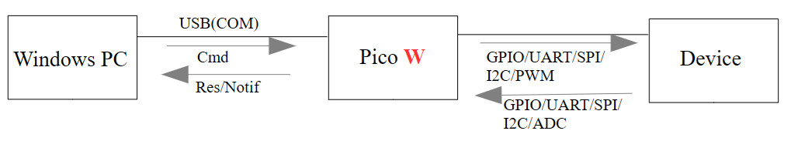
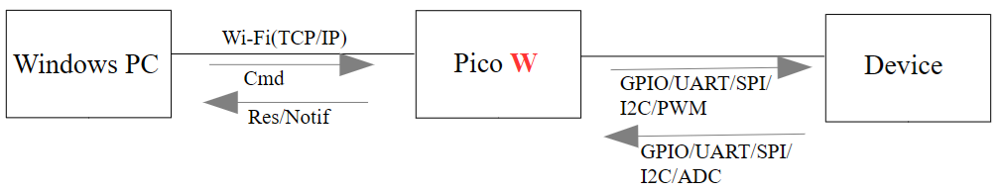
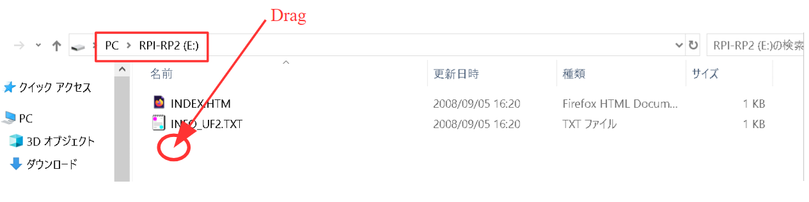
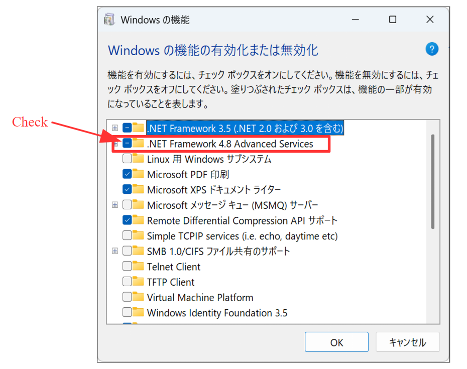
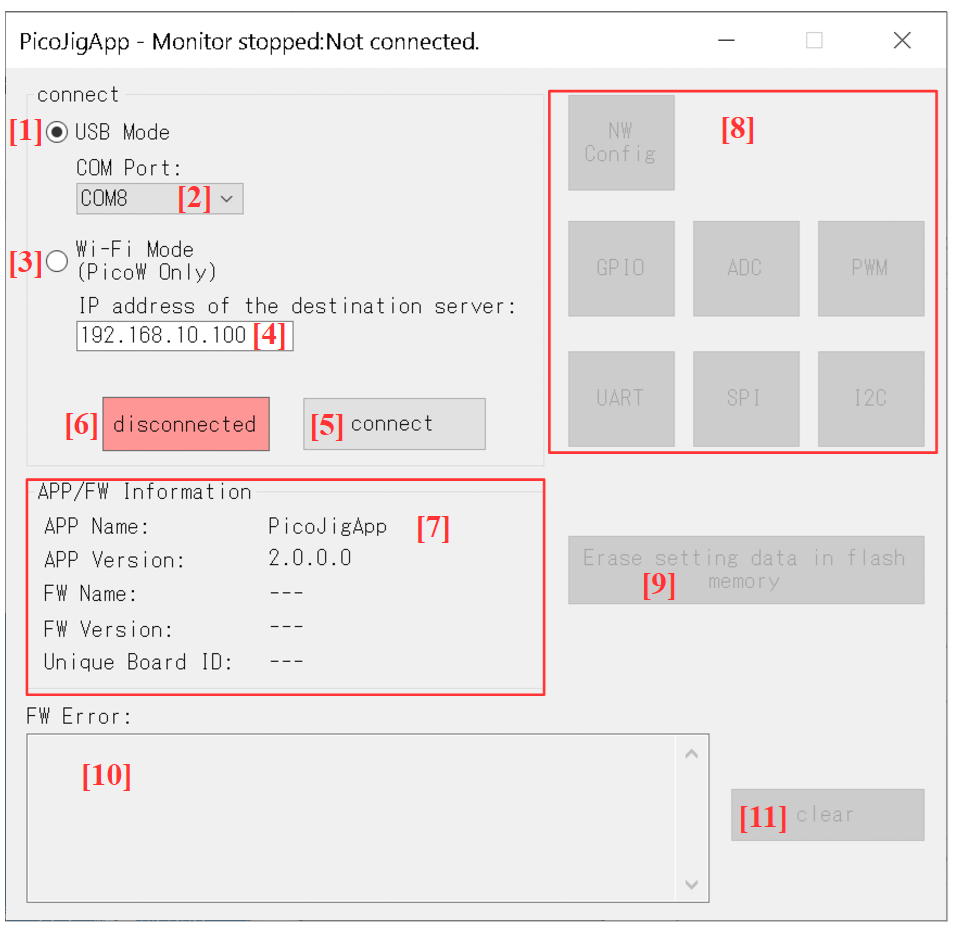
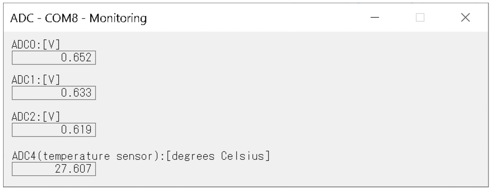
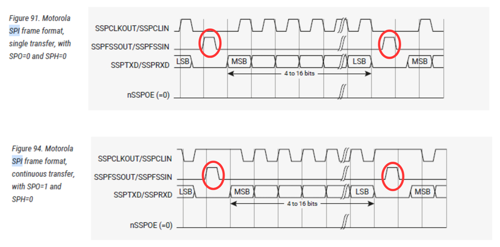
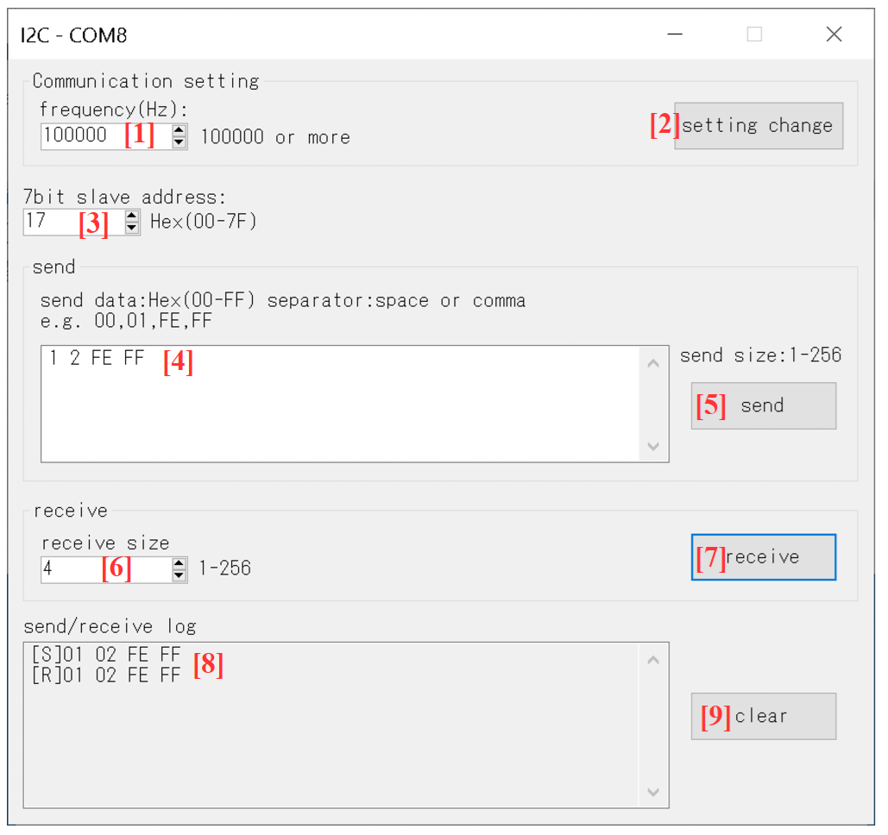
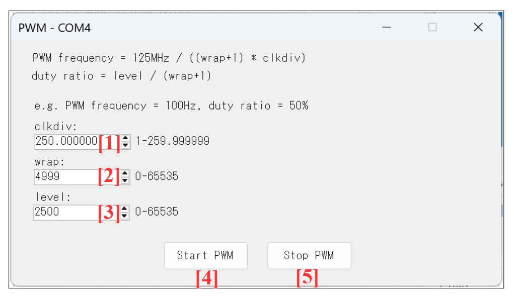

PicoJig, PicoJig-WL Manual

# Table of Contents

- [Terms of Use](#terms-of-use)
- [Overview](#overview)
  - [PicoJig-WL](#picojig-wl)
  - [PicoJig](#picojig)
- [Contents](#contents)
  - [Firmware (FW)](#firmware-fw)
  - [PC App](#pc-app)
- [Setup](#setup)
  - [Writing FW to Pico or Pico W](#writing-fw-to-pico-or-pico-w)
  - [PC Side Setup](#pc-side-setup)
- [LED](#led)
  - [PicoJig LED Lighting Status](#picojig-led-lighting-status)
  - [PicoJig-WL LED Lighting Status](#picojig-wl-led-lighting-status)
- [Main Window and Startup](#main-window-and-startup)
  - [Main Window](#main-window)
  - [Startup in USB Mode](#startup-in-usb-mode)
  - [Startup in Wi-Fi Mode](#startup-in-wi-fi-mode)
  - [Checking FW Errors](#checking-fw-errors)
  - [Erasing Settings Data in Flash Memory](#erasing-settings-data-in-flash-memory)
- [Wi-Fi Settings](#wi-fi-settings)
  - [NW Config Window](#nw-config-window)
- [GPIO](#gpio)
  - [Pins Used for GPIO](#pins-used-for-gpio)
  - [GPIO Window](#gpio-window)
- [ADC](#adc)
  - [Pins Used for ADC](#pins-used-for-adc)
  - [ADC Window](#adc-window)
- [UART](#uart)
  - [Pins Used for UART](#pins-used-for-uart)
  - [UART Window](#uart-window)
- [SPI](#spi)
  - [Pins Used for SPI](#pins-used-for-spi)
  - [SPI Notes](#spi-notes)
  - [SPI Window](#spi-window)
- [I2C](#i2c)
  - [Pins Used for I2C](#pins-used-for-i2c)
  - [I2C Notes](#i2c-notes)
  - [I2C Window](#i2c-window)
- [PWM](#pwm)
  - [Pins Used for PWM](#pins-used-for-pwm)
  - [PWM Window](#pwm-window)

# Terms of Use

\* When using PicoJig/PicoJig-WL, please check the terms of use at the following URL:  
<https://sites.google.com/view/shiomachisoft/%E5%88%A9%E7%94%A8%E8%A6%8F%E7%B4%84>

Please note that Shiomachi Software (creator of PicoJig/PicoJig-WL) shall not be held responsible for any trouble, loss, or damage caused by the use of PicoJig/PicoJig-WL or by executing the procedures described in this document.

# Overview

## PicoJig-WL

PicoJig-WL is a FW and PC app that controls GPIO/UART/SPI/I2C/ADC/PWM of Raspberry Pi Pico W via USB (Virtual COM) or Wi-Fi (TCP socket communication).

There are two modes: USB mode and Wi-Fi mode.

- The microcontroller board uses a Raspberry Pi Pico W.

- In Wi-Fi mode, the Pico W becomes a TCP server. The PC becomes a TCP client.

- Wi-Fi mode requires a Wi-Fi router that supports the Wi-Fi standard "IEEE 802.11b/g/n" using the 2.4GHz band.

- The SPI and I2C of Pico W are masters.

[System Configuration]

- USB mode

  

- Wi-Fi mode

  

## PicoJig

PicoJig is a FW and PC app that controls GPIO/UART/SPI/I2C/ADC/PWM of Raspberry Pi Pico via USB (Virtual COM).

- The microcontroller board uses a Raspberry Pi Pico.

- The SPI and I2C of Pico are masters.

[System Configuration]

- USB mode

  

# Contents

## Firmware (FW)

(1) PicoJig_*XXXXXXXX*.uf2

- *XXXXXXXX* is the version date.

- FW for PicoJig, to be written to the Pico.

(2) PicoJig_WL_*XXXXXXXX*.uf2

- *XXXXXXXX* is the version date.

- FW for PicoJig-WL, to be written to the Pico W.

## PC App

(1) PicoJigApp folder

- This folder contains the binaries of PicoJigApp (the app running on a Windows PC).

# Setup

## Writing FW to Pico or Pico W

The following is the procedure for writing the FW to the Pico or Pico W.

- Note

  - When using PicoJig, write PicoJig_*XXXXXXXX*.uf2 to the Pico.

  - When using PicoJig-WL, write PicoJig_WL_*XXXXXXXX*.uf2 to the Pico W.

(1) While pressing the white button (BOOTSEL button) on the Pico (Pico W), connect the PC and Pico (Pico W) with a USB cable. Then, the RPI-RP2 drive will be recognized.

(2) Drag and drop PicoJig_*XXXXXXXX*.uf2 (PicoJig_WL_*XXXXXXXX*.uf2) into RPI-RP2.

This completes the FW writing.

The FW will start when the Pico (Pico W) is powered on.

## PC Side Setup

(1) Please copy the *entire* PicoJigApp folder to an appropriate location on your PC (such as the Desktop).

(2) Checking the `.NET Framework` version

- *In a Windows environment, .NET Framework 4.6.2 or later (4.x.x) must be enabled.* It is not compatible with `.NET 5` or higher.

  - Enabling `.NET Framework` is at your own risk.

- However, since `.NET Framework 4.8` is enabled by default in Windows 11, you basically do not need to do anything. You can check if `.NET Framework 4.8` is enabled in Windows as follows:

  - Open "Control Panel" => "Programs" => "Turn Windows features on or off".

  - Check that the `.NET Framework 4.8` checkbox is ON.

    

# LED

## PicoJig LED Lighting Status

- If the FW has not detected an error, the LED flashes at 500ms intervals.

- If the FW has detected an error, the LED flashes at 100ms intervals.

## PicoJig-WL LED Lighting Status

- If the FW has not detected an error and is not connected to a Wi-Fi router, the LED flashes at 500ms intervals.

- If the FW has not detected an error and is connected to a Wi-Fi router, the LED lights up continuously.

- If the FW has detected an error, the LED flashes at 100ms intervals.

# Main Window and Startup

## Main Window

## Startup in USB Mode

\* USB mode can be used with both PicoJig and PicoJig-WL.  

(1) After connecting the Pico with a USB cable, wait about 10 seconds and double-click PicoJigApp.exe in the PicoJigApp folder.

- The reason for waiting about 10 seconds is that it takes time for Windows to recognize the virtual COM of the Pico.

- Double-clicking PicoJigApp.exe will display the [Main Window].

(2) Turn ON [1] on the [Main Window] to select USB mode.

(3) Select the COM port number of the Pico at [2] on the [Main Window], then press button [5].

- If the display at [6] on the [Main Window] changes to "connected", the connection with Pico in USB mode is established.
- When the display at [6] on the [Main Window] changes to "connected", buttons [8], [9], and [11] on the [Main Window] are enabled. FW information is also displayed at [7].

## Startup in Wi-Fi Mode

\* Wi-Fi mode can only be used with PicoJig-WL.  

(1) First, follow the procedure in the [Startup in USB Mode] chapter to start in USB mode.

- To save Wi-Fi settings to the Flash memory of Pico W, you must first start in USB mode.

(2) Press the [NW Config] button inside [8] on the [Main Window] to display the [NW Config Window] and configure Wi-Fi settings.

- **Since Wi-Fi settings are saved in the Flash memory of Pico W, you do not need to do this every time.**

- For how to configure Wi-Fi settings, please refer to the [NW Config Window] chapter.

(3) After configuring Wi-Fi settings, confirm that the LED of Pico W is lit continuously instead of flashing (= connected to the Wi-Fi router).

(4) Close the virtual COM of Pico W with the following operation:

- Confirm that the display of button [5] on the [Main Window] is "disconnect", and press button [5].

- Then, confirm that the display at [6] on the [Main Window] becomes "disconnected".

(5) Confirm that the LED of Pico W is lit continuously instead of flashing (= connected to the Wi-Fi router).

(6) Turn ON [3] on the [Main Window] to select Wi-Fi mode.

(7) Specify the IP address of the Pico W you want to connect to via TCP in [4] on the [Main Window].

- The network portion of the IP addresses of the PC and Pico W must be the same.

(8) To establish a TCP connection with Pico W, confirm that the display of button [5] is "connect" before pressing button [5].

- If the display at [6] becomes "connected", the TCP connection with Pico W is successful (= connected in Wi-Fi mode).

- When the display at [6] on the [Main Window] changes to "connected", buttons [8], [9], and [11] on the [Main Window] are enabled. FW information is also displayed at [7].

## Checking FW Errors

Errors recognized by the FW are displayed at [10] on the [Main Window].

To clear the errors recognized by the FW, press button [11] on the [Main Window].

Examples of errors recognized by the FW include the following:

[Examples]

- Microcontroller reset due to WDT timeout

- UART:Framing error

- UART:Parity error

- UART:Break error

- UART:Overrun error

- I2C:address not acknowledged, or, no device present.

- I2C communication timeout

- Requested data discarded because the buffer has no space (USB transmission)

- Requested data discarded because the buffer has no space (UART transmission)

- Requested data discarded because the buffer has no space (UART reception)

- Requested data discarded because the buffer has no space (I2C transmission/reception)

## Erasing Settings Data in Flash Memory

The following settings data are saved in the back of the Flash memory of Pico (Pico W).

- Wi-Fi settings

- GPIO settings

- UART settings

- SPI settings

- I2C settings

\* If you are no longer using PicoJig/PicoJig-WL, it is recommended to erase the settings data saved in the back of the Flash memory using button [9] on the [Main Window].  

# Wi-Fi Settings

## NW Config Window

The NW Config Window is displayed by pressing the [NW Config] button inside [8] on the [Main Window].

(1) Enter the IP address you want to set for Pico W in the box [1].

- [Example]
  - When setting the IP address of Pico W to 192.168.10.100:

    - 192.168.10.100

(2) Enter the SSID of the Wi-Fi router in the box [2].

- **Conditions for the Wi-Fi router SSID that can be specified**

  - It must support the Wi-Fi standard "IEEE 802.11b/g/n" using the 2.4GHz band. Please be careful not to accidentally specify a 5GHz frequency band SSID.

  - The encryption method must be WPA2.

(3) Enter the password of the Wi-Fi router in the box [3].

(4) Pressing button [4] saves the settings data to the back of the Flash memory of Pico W (Wi-Fi settings are applied).

- After the Wi-Fi settings are complete, Pico W attempts to connect to the Wi-Fi router. If it successfully connects to the Wi-Fi router, the LED will light continuously instead of flashing.

# GPIO

## Pins Used for GPIO

The pins used for GPIO are as follows:

[Input GPIO]

- GP3=Pin 5

- GP4=Pin 6

- GP5=Pin 7

- GP8=Pin 11

- GP9=Pin 12

- GP10=Pin 14

- GP11=Pin 15

[Output GPIO]

- GP12=Pin 16

- GP13=Pin 17

- GP14=Pin 19

- GP15=Pin 20

- GP20=Pin 26

- GP21=Pin 27

- GP22=Pin 29

## GPIO Window

The GPIO Window is displayed by pressing the [GPIO] button inside [8] on the [Main Window].

(1) The current value (High/Low) of the input GPIO is displayed at [1].

(2) The current value (High/Low) of the output GPIO is displayed at [2].

(3) Change the value (High/Low) of the output GPIO using the following procedure:

1. Select High/Low for GP12 to GP22 using the buttons inside [3].

2. Press button [4].

(4) Change the GPIO settings using the following procedure:

1. Select the built-in Pull-Up/Pull-Down for the input GPIO using the buttons inside [5].

2. Select the output value upon power ON for the output GPIO using the buttons inside [6].

3. Press button [7].

   - Pressing button [7] saves the settings data to the back of the Flash memory of Pico (Pico W).

# ADC

## Pins Used for ADC

The pins used for ADC are as follows:

- ADC0=GP26=Pin 31

- ADC1=GP27=Pin 32

- ADC2=GP28=Pin 34

- ADC4=Temperature Sensor

## ADC Window

The ADC Window is displayed by pressing the [ADC] button inside [8] on the [Main Window].

The voltage values (V) of ADC0 to ADC2 and the temperature sensor value (degrees C) of ADC4 are displayed.

# UART

## Pins Used for UART

The pins used for UART are as follows:

- UART0 TX=GP0=Pin 1

- UART0 RX=GP1=Pin 2

## UART Window

The UART Window is displayed by pressing the [UART] button inside [8] on the [Main Window].

(1) Change the UART settings using the following procedure:

1. Select the baud rate at [1].

2. Select the stop bit at [2].

3. Select the parity at [3].

   - **The data bits are fixed to 8.**

4. Press button [4].

   - Pressing button [4] saves the settings data to the back of the Flash memory of Pico (Pico W).

(2) Perform UART transmission using the following procedure:

1. Enter the transmission data in 2-digit hexadecimal (separated by space or comma) at [5].

   - The transmission data size must be 1 to 256 bytes.

2. Press button [6].

(3) The transmission/reception data log is displayed at [7].

(4) Pressing button [8] clears the transmission/reception data log.

# SPI

## Pins Used for SPI

The pins used for SPI are as follows:

- SPI0 RX=GP16=Pin 21

- SPI0 CSn=GP17=Pin 22

- SPI0 SCK=GP18=Pin 24

- SPI0 TX=GP19=Pin 25

## SPI Notes

(1) PicoJig acts as an SPI master.

(2) Regarding CS:

1. CS is Low while PicoJig is transmitting the SPI clock. Otherwise (when idle), CS is High.

2. CS goes Low 5us before the SPI clock starts transmitting.

3. CS goes High 5us after the SPI clock transmission is completed.

4. The CS pin is software-controlled using GPIO, rather than using the hardware SPI CSn function.

   - Reason:

     When using the RP2040 as an SPI master, in Mode 0 and Mode 2, there is a special specification where CS toggles High/Low for each byte, as shown in the figure below. This is to avoid this unnecessary toggling behavior.

     In PicoJig, to keep CS stably Low during SPI clock transmission, outputs like 1 to 3 above are performed via GPIO control without using the SPI CSn function.

     

5. When PicoJig's communication partner (SPI slave) is also a Raspberry Pi Pico:

   - In this case, please use Mode 1 or Mode 3.

     - Reason:
       When using the RP2040 as an SPI slave, Mode 0 and Mode 2 expect CS to go High for every byte. Since PicoJig keeps CS Low during communication, this expectation is not met, and communication fails. Therefore, you must use Mode 1 or Mode 3.

## SPI Window

The SPI Window is displayed by pressing the [SPI] button inside [8] on the [Main Window].

(1) Change the SPI settings using the following procedure:

1. Enter the frequency (Hz) at [1].

2. Select the SPI mode at [2].

   - **Data bits are fixed at 8, and bit order is fixed at MSB first.**

3. Press button [3].

   - Pressing button [3] saves the settings data to the back of the Flash memory of Pico (Pico W).

(2) Perform SPI transmission using the following procedure:

1. Enter the transmission data in 2-digit hexadecimal (separated by space or comma) at [4].

   - The transmission data size must be 1 to 256 bytes.

2. Press button [5].

   - Since it is an SPI transmission from a master, it receives simultaneously with the transmission.

(3) The transmission/reception data log is displayed at [6].

(4) Pressing button [7] clears the transmission/reception data log.

# I2C

## Pins Used for I2C

The pins used for I2C are as follows:

- I2C1 SDA=GP6=Pin 9

- I2C1 SCL=GP7=Pin 10

## I2C Notes

(1) PicoJig acts as an I2C master.

## I2C Window

The I2C Window is displayed by pressing the [I2C] button inside [8] on the [Main Window].

(1) Change the I2C settings using the following procedure:

1. Enter the frequency (Hz) at [1].

2. Press button [2].

   - Pressing button [2] saves the settings data to the back of the Flash memory of Pico (Pico W).

(2) Perform I2C transmission using the following procedure:

1. Enter the 7-bit slave address (hexadecimal) at [3].

2. Enter the transmission data in 2-digit hexadecimal (separated by space or comma) at [4].

   - The transmission data size must be 1 to 256 bytes.

3. Press button [5].

(3) Perform I2C reception using the following procedure:

1. Enter the 7-bit slave address (hexadecimal) at [3].

2. Enter the reception data size at [6].

   - The reception data size must be 1 to 256 bytes.

3. Press button [7].

(4) The transmission/reception data log is displayed at [8].

(5) Pressing button [9] clears the transmission/reception data log.

# PWM

## Pins Used for PWM

The pins used for PWM are as follows:

- GP2=Pin 4

## PWM Window

The PWM Window is displayed by pressing the [PWM] button inside [8] on the [Main Window].

(1) Perform PWM output using the following procedure:

1. Enter the clock divider at [1].

2. Enter the wrap value at [2].

3. Enter the level at [3].

   - `PWM Frequency = 125MHz / ((Wrap Value + 1) * Clock Divider)`

   - `Duty Cycle = Level / (Wrap Value + 1)`

4. Press button [4].

(2) Pressing button [5] stops the PWM output.