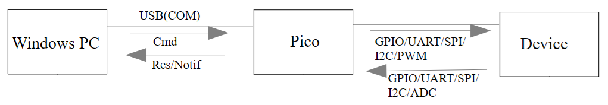
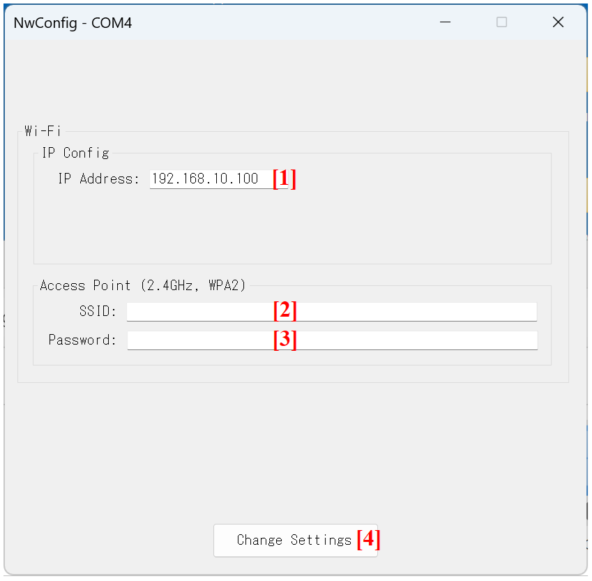
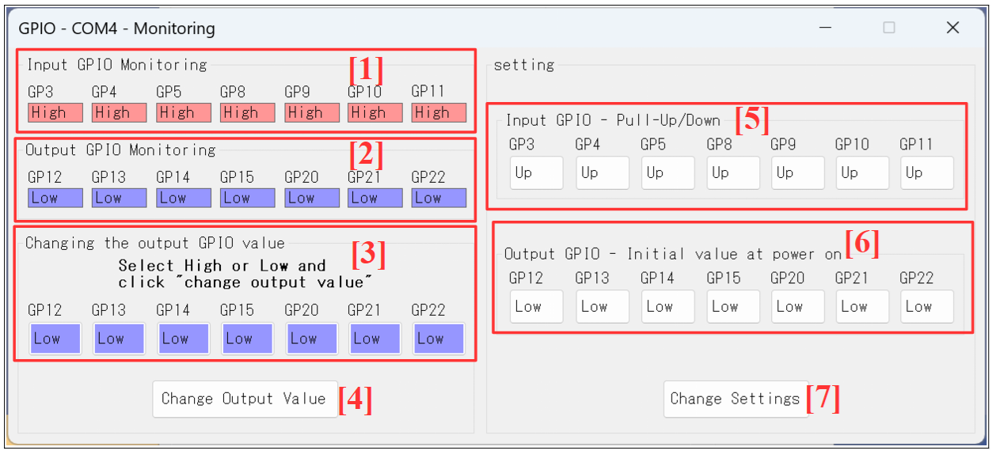
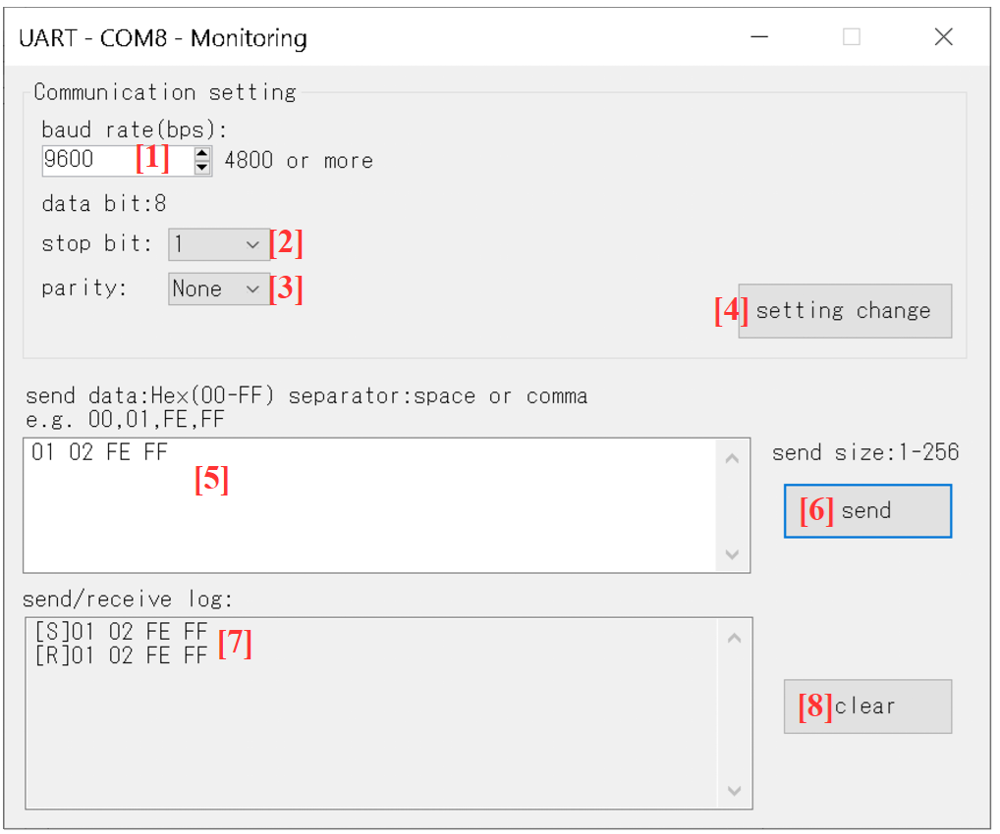
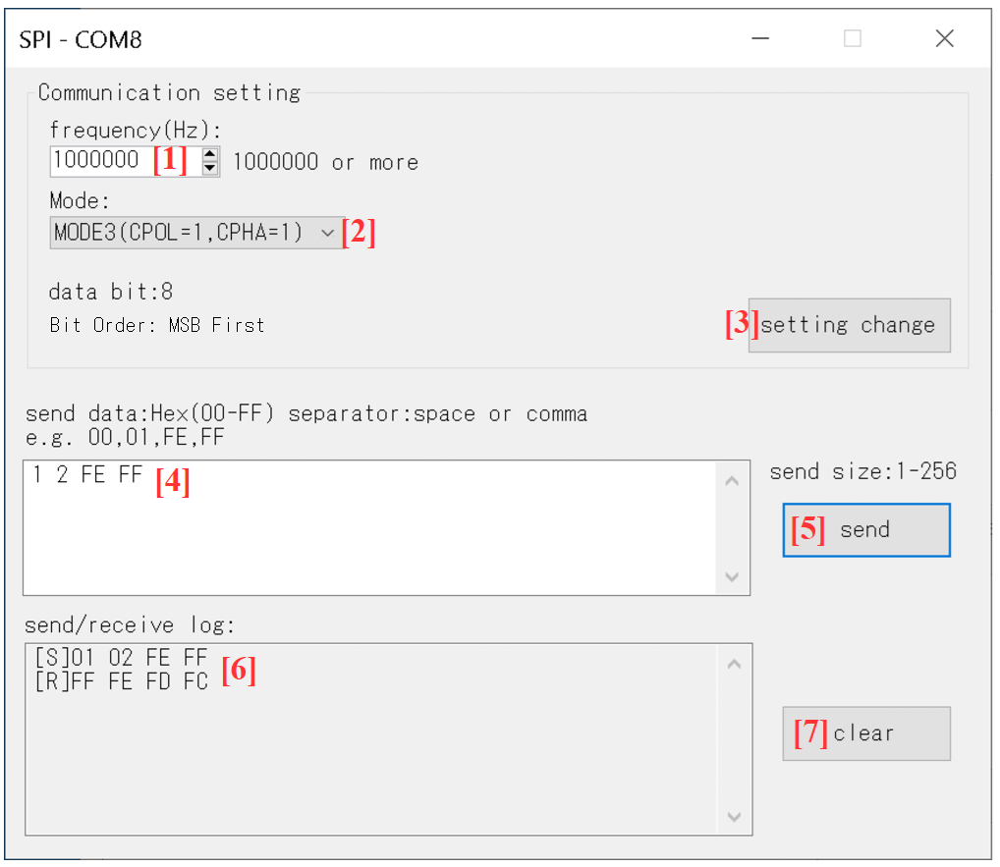

PicoJig, PicoJig-WLマニュアル

# 目次

- [利用規約](#利用規約)
- [概要](#概要)
  - [PicoJig-WL](#picojig-wl)
  - [PicoJig](#picojig)
- [内容物](#内容物)
  - [ファームウェア(FW)](#ファームウェアfw)
  - [PCアプリ](#pcアプリ)
- [セットアップ](#セットアップ)
  - [PicoまたはPico WにFWを書き込む](#picoまたはpico-wにfwを書き込む)
  - [PC側のセットアップ](#pc側のセットアップ)
- [LED](#led)
  - [PicoJigのLED点灯内容](#picojigのled点灯内容)
  - [PicoJig-WLのLED点灯内容](#picojig-wlのled点灯内容)
- [メイン画面と起動](#メイン画面と起動)
  - [メイン画面](#メイン画面)
  - [USBモードでの起動](#usbモードでの起動)
  - [Wi-Fiモードでの起動](#wi-fiモードでの起動)
  - [FWエラーの確認](#fwエラーの確認)
  - [Flashメモリ内の設定データの消去](#flashメモリ内の設定データの消去)
- [Wi-Fi設定](#wi-fi設定)
  - [NW Config画面](#nw-config画面)
- [GPIO](#gpio)
  - [GPIOで使用するピン](#gpioで使用するピン)
  - [GPIO画面](#gpio画面)
- [ADC](#adc)
  - [ADCで使用するピン](#adcで使用するピン)
  - [ADC画面](#adc画面)
- [UART](#uart)
  - [UARTで使用するピン](#uartで使用するピン)
  - [UART画面](#uart画面)
- [SPI](#spi)
  - [SPIで使用するピン](#spiで使用するピン)
  - [SPIの注意事項](#spiの注意事項)
  - [SPI画面](#spi画面)
- [I2C](#i2c)
  - [I2Cで使用するピン](#i2cで使用するピン)
  - [I2Cの注意事項](#i2cの注意事項)
  - [I2C画面](#i2c画面)
- [PWM](#pwm)
  - [PWMで使用するピン](#pwmで使用するピン)
  - [PWM画面](#pwm画面)

# 利用規約

※PicoJig・PicoJig-WLを使用する場合、下記のURLの利用規約を確認して下さい。
<https://sites.google.com/view/shiomachisoft/%E5%88%A9%E7%94%A8%E8%A6%8F%E7%B4%84>

なお、PicoJig・PicoJig-WLの使用、または本書に記載された手順を実行したことにより発生したいかなるトラブル・損失・損害についても、塩町ソフトウェア(PicoJig・PicoJig-WLの作成者)は一切責任を負いません。

# 概要

## PicoJig-WL

PicoJig-WLは、USB（仮想COM）またはWi-Fi（TCPソケット通信）経由でRaspberry Pi Pico WのGPIO/UART/SPI/I2C/ADC/PWMを制御するFWとPCアプリです。

USBモードとWi-Fiモードの2種類があります。

- マイコン基板はRaspberry Pi Pico Wを使用します。

- Wi-Fiモードの場合、Pico WはTCPサーバーになります。PCはTCPクライアントになります。

- Wi-Fiモードでは、2.4GHz帯を使用するWi-Fi規格「IEEE 802.11b/g/n」をサポートするWi-Fiルーターが必要です。

- Pico WのSPI, I2Cはマスタです。

【システム構成】

- USBモード

  

- Wi-Fiモード

  

## PicoJig

PicoJigは、USB（仮想COM）経由でRaspberry Pi PicoのGPIO/UART/SPI/I2C/ADC/PWMを制御するFWとPCアプリです。

- マイコン基板はRaspberry Pi Picoを使用します。

- PicoのSPI, I2Cはマスタです。

【システム構成】

- USBモード

  

# 内容物

## ファームウェア(FW)

(1) PicoJig_*XXXXXXXX*.uf2

- ※*XXXXXXXX*はバージョン日付になります。

- PicoJig用のFWであり、Picoに書き込みます。

(2) PicoJig_WL_*XXXXXXXX*.uf2

- ※*XXXXXXXX*はバージョン日付になります。

- PicoJig-WL用のFWであり、Pico Wに書き込みます。

## PCアプリ

(1) PicoJigApp_*XXXXX*フォルダ

- ※*XXXXX*はバージョンになります。

- このフォルダには、PicoJigApp（Windows PC上で実行するアプリ）のバイナリが含まれます。

# セットアップ

## PicoまたはPico WにFWを書き込む

以下は、PicoまたはPico WにFWを書き込む手順です。

- 注意

  - ※PicoJigを使用する場合は、PicoにPicoJig_*XXXXXXXX*.uf2を書き込みます。

  - ※PicoJig-WLを使用する場合は、Pico WにPicoJig_WL_*XXXXXXXX*.uf2を書き込みます。

(1) Pico（Pico W）の白いボタン（BOOTSELボタン）を押しながら、PCとPico（Pico W）をUSBケーブルで接続します。すると、RPI-RP2のドライブが認識されます。

(2) RPI-RP2の中にPicoJig_*XXXXXXXX*.uf2（PicoJig_WL_*XXXXXXXX*.uf2）をドラッグ＆ドロップします。

以上で、FWの書き込みは終了です。

なお、Pico（Pico W）の電源が入ったタイミングでFWは起動します。

## PC側のセットアップ

(1) PicoJigApp_*XXXXX*フォルダをPCの適当な場所（デスクトップなど）に*フォルダごと*コピーして下さい。

(2) `.NET Framework`のバージョン確認

- *Windows環境では、.NET Framework 4.6.2以降（4.x.x）が有効になっている必要があります。*`.NET 5`以上とは互換性がありません。

  - ※`.NET Framework`の有効化は自己責任です。

- ただ、Windows11ではデフォルトで`.NET Framework 4.8`が有効になっているため、基本的に何もする必要はありません。Windowsで`.NET Framework 4.8`が有効になっているかどうかは次で確認できます。

  - 「コントロール パネル」⇒「プログラム」⇒「Windowsの機能の有効化または無効化」を開く。

  - `.NET Framework 4.8`のチェックボックスがONになっていることを確認する。

    

# LED

## PicoJigのLED点灯内容

- FWがエラーを検出していない場合、LEDは500ms間隔で点滅します。

- FWがエラーを検出している場合、LEDは100ms間隔で点滅します。

## PicoJig-WLのLED点灯内容

- FWがエラーを検出しておらず、かつ、Wi-Fiルーターと接続できていない場合、LEDは500ms間隔で点滅します。

- FWがエラーを検出しておらず、かつ、Wi-Fiルーターと接続できている場合、LEDは点灯します。

- FWがエラーを検出している場合、LEDは100ms間隔で点滅します。

# メイン画面と起動

## メイン画面

## USBモードでの起動

※USBモードは、PicoJigとPicoJig-WLの両方で使用できます。

(1) PicoをUSBケーブルで接続してから10秒程度待った後にPicoJigApp_*XXXXX*フォルダの中のPicoJigApp.exeをダブルクリックします。

- ※10秒程度待つのは、WindowsがPicoの仮想COMを認識するのに時間がかかるためです。

- PicoJigApp.exeをダブルクリックすると【メイン画面】が表示されます。

(2) 【メイン画面】の[1]をONにしてUSBモードを選択します。

(3) 【メイン画面】の[2]でPicoのCOM番号を選択した後に、[5]のボタンを押します。

- 【メイン画面】の[6]の表示が"connected"に変わっていればUSBモードでPicoと接続できています。
- 【メイン画面】の[6]の表示が"connected"に変わると、【メイン画面】の[8][9][11]のボタンが有効になります。また、[7]にFW情報が表示されます。

## Wi-Fiモードでの起動

※Wi-Fiモードは、PicoJig-WLのみ使用できます。

(1) 最初に、【USBモードでの起動】の章の手順を行ってUSBモードで起動して下さい。

- ※Pico WのFlashメモリにWi-Fi設定を保存するために、最初はUSBモードで起動する必要があります。

(2) 【メイン画面】の[8]の中の[NW Config]ボタンを押し、【NW Config画面】を表示してWi-Fi設定を行います。

- **※Wi-Fi設定は、Pico WのFlashメモリに保存されるため毎回行う必要はありません。**

- ※Wi-Fi設定の操作方法については、【NW Config画面】の章を参照して下さい。

(3) Wi-Fi設定後、Pico WのLEDが点滅ではなく点灯（＝Wi-Fiルーターと接続済み）になっていることを確認します。

(4) 下記の操作でPico Wの仮想COMをクローズします。

- 【メイン画面】の[5]のボタンの表示がdisconnectであることを確認し、[5]のボタンを押します。

- そして、【メイン画面】の[6]の表示が"disconnected"になることを確認します。

(5) Pico WのLEDが点滅ではなく点灯（＝Wi-Fiルーターと接続済み）であることを確認します。

(6) 【メイン画面】の[3]をONにしてWi-Fiモードを選択します。

(7) 【メイン画面】の[4]にTCP接続したいPico WのIPアドレスを指定します。

- ※PCとPico WのIPアドレスのネットワーク部は同じである必要があります。

(8) Pico WとTCP接続するために、[5]のボタンの表示がconnectであることを確認してから[5]のボタンを押します。

- [6]の表示が"connected"になれば、Pico WとTCP接続は成功しています（＝Wi-Fiモードで接続できています）。

- 【メイン画面】の[6]の表示が"connected"に変わると、【メイン画面】の[8][9][11]のボタンが有効になります。また、[7]にFW情報が表示されます。

## FWエラーの確認

FWが認識したエラーは【メイン画面】の[10]に表示されます。

FWが認識したエラーをクリアしたい場合は、【メイン画面】の[11]のボタンを押します。

FWが認識するエラーの例として、以下のようなものがあります。

【例】

- WDTタイムアウトでマイコンがリセットした

- UART:Framing error

- UART:Parity error

- UART:Break error

- UART:Overrun error

- I2C:address not acknowledged, or, no device present.

- I2C通信でタイムアウト

- バッファに空きがないので要求データを破棄した（USB送信）

- バッファに空きがないので要求データを破棄した（UART送信）

- バッファに空きがないので要求データを破棄した（UART受信）

- バッファに空きがないので要求データを破棄した（I2C送信/受信）

## Flashメモリ内の設定データの消去

以下の設定データは、Pico（Pico W）のFlashメモリ内の後方に保存されます。

- Wi-Fi設定

- GPIO設定

- UART設定

- SPI設定

- I2C設定

※PicoJig・PicoJig-WLをもう使用しない場合は、【メイン画面】の[9]のボタンでFlashメモリ内の後方に保存されている設定データを消去することをお勧めします。

# Wi-Fi設定

## NW Config画面

NW Config画面は、【メイン画面】の[8]の中の[NW Config]ボタンを押すと表示されます。

(1) [1]のボックスに、Pico Wに設定したいIPアドレスを入力します。

- 【例】
  - Pico WのIPアドレスを192.168.10.100にしたい場合：

    - 192.168.10.100

(2) [2]のボックスにWi-FiルーターのSSIDを入力します。

- **指定できるWi-FiルーターのSSIDの条件**

  - 2.4GHz帯を使用するWi-Fi規格「IEEE 802.11b/g/n」に対応していること。間違えて5GHzの周波数帯のSSIDを指定しないようにご注意下さい。

  - 暗号化方式はWPA2であること。

(3) [3]のボックスにWi-Fiルーターのパスワードを入力します。

(4) [4]のボタンを押すと、設定データはPico WのFlashメモリ内の後方に保存されます（Wi-Fi設定が行われます）。

- Wi-Fi設定が終わると、Pico WはWi-Fiルーターへの接続を試みます。Wi-Fiルーターと接続できた場合、LEDが点滅ではなく点灯になります。

# GPIO

## GPIOで使用するピン

GPIOで使用するピンは以下です。

【入力GPIO】

- GP3=5番ピン

- GP4=6番ピン

- GP5=7番ピン

- GP8=11番ピン

- GP9=12番ピン

- GP10=14番ピン

- GP11=15番ピン

【出力GPIO】

- GP12=16番ピン

- GP13=17番ピン

- GP14=19番ピン

- GP15=20番ピン

- GP20=26番ピン

- GP21=27番ピン

- GP22=29番ピン

## GPIO画面

GPIO画面は、【メイン画面】の[8]の中の[GPIO]ボタンを押すと表示されます。

(1) [1]に、入力GPIOの現在値(High/Low)が表示されます。

(2) [2]に、出力GPIOの現在値(High/Low)が表示されます。

(3) 以下の手順で出力GPIOの値（High/Low）を変更します。

- ①[3]の中のボタンでGP12～GP22のHigh/Lowを選択します。

- ②[4]のボタンを押します。

(4) 以下の手順でGPIOの設定を変更します。

- ①[5]の中のボタンで入力GPIOの内蔵Pull-Up/Pull-Downを選択します。

- ②[6]の中のボタンで出力GPIOの電源ON時出力値を選択します。

- ③[7]のボタンを押します。

  - [7]のボタンを押すと、設定データはPico（Pico W）のFlashメモリ内の後方に保存されます。

# ADC

## ADCで使用するピン

ADCで使用するピンは以下です。

- ADC0=GP26=31番ピン

- ADC1=GP27=32番ピン

- ADC2=GP28=34番ピン

- ADC4=温度センサ

## ADC画面

ADC画面は、【メイン画面】の[8]の中の[ADC]ボタンを押すと表示されます。

ADC0～ADC2の電圧値（V）とADC4の温度センサ値（℃）が表示されます。

# UART

## UARTで使用するピン

UARTで使用するピンは以下です。

- UART0 TX=GP0=1番ピン

- UART0 RX=GP1=2番ピン

## UART画面

UART画面は、【メイン画面】の[8]の中の[UART]ボタンを押すと表示されます。

(1) 以下の手順でUARTの設定を変更します。

- ①[1]でボーレートを選択します。

- ②[2]でストップビットを選択します。

- ③[3]でパリティを選択します。

  - **※データビットは8固定です。**

- ④[4]のボタンを押します。

  - [4]のボタンを押すと、設定データはPico（Pico W）のFlashメモリ内の後方に保存されます。

(2) 以下の手順でUART送信を行います。

- ①[5]に送信データを16進数2桁（スペースまたはカンマ区切り）で入力します。

  - ※送信データサイズは1～256byteにして下さい。

- ②[6]のボタンを押します。

(3) [7]に送受信データのログが表示されます。

(4) [8]のボタンを押すと送受信データのログがクリアされます。

# SPI

## SPIで使用するピン

SPIで使用するピンは以下です。

- SPI0 RX=GP16=21番ピン

- SPI0 CSn=GP17=22番ピン

- SPI0 SCK=GP18=24番ピン

- SPI0 TX=GP19=25番ピン

## SPIの注意事項

(1) PicoJigはSPIマスタになります。

(2) CSについて：

- ①PicoJigがSPIのクロックを送信している間はCSはLowです。それ以外（アイドル時）はCSはHighです。

- ②SPIのクロックを送信する5us前からCSはLowになります。

- ③SPIのクロック送信完了後に5us経過してからCSはHighになります。

- ④CSピンはハードウェアのSPI CSn機能を使用せず、GPIOを用いてソフトウェア制御しています。

  - 理由：

    RP2040をSPIマスタとして使用する際、モード0およびモード2では下図の通り、バイトごとにCSがHigh/Lowに切り替わるという特殊な仕様となっています。この不要な切り替え動作を回避するためです。

    PicoJigでは、SPIクロック送信中にCSを安定してLowに維持するため、SPI CSn機能を使わずGPIO制御によって上記の①～③のような出力を行っています。

    

- ⑤PicoJigの通信相手（SPIスレーブ）もRaspberry Pi Picoである場合：

  - このケースでは、モード1かモード3を使用して下さい。

    - 理由：
      RP2040をSPIスレーブとして使用する場合、モード0およびモード2では、1バイトごとにCSがHighになることを期待します。PicoJigは通信中CSをLowに維持するため、この期待に沿わず通信が失敗します。そのため、モード1またはモード3を使用する必要があります。

## SPI画面

SPI画面は、【メイン画面】の[8]の中の[SPI]ボタンを押すと表示されます。

(1) 以下の手順でSPIの設定を変更します。

- ①[1]で周波数（Hz）を入力します。

- ②[2]でSPIのモードを選択します。

  - **※データビットは8固定、ビットオーダーはMSBファースト固定です。**

- ③[3]のボタンを押します。

  - [3]のボタンを押すと、設定データはPico（Pico W）のFlashメモリ内の後方に保存されます。

(2) 以下の手順でSPI送信を行います。

- ①[4]に送信データを16進数2桁（スペースまたはカンマ区切り）で入力します。

  - ※送信データサイズは1～256byteにして下さい。

- ②[5]のボタンを押します。

  - ※マスタのSPI送信なので、送信と同時に受信します。

(3) [6]に送受信データのログが表示されます。

(4) [7]のボタンを押すと送受信データのログがクリアされます。

# I2C

## I2Cで使用するピン

I2Cで使用するピンは以下です。

- I2C1 SDA=GP6=9番ピン

- I2C1 SCL=GP7=10番ピン

## I2Cの注意事項

(1) PicoJigはI2Cマスタになります。

## I2C画面

I2C画面は、【メイン画面】の[8]の中の[I2C]ボタンを押すと表示されます。

(1) 以下の手順でI2Cの設定を変更します。

- ①[1]で周波数（Hz）を入力します。

- ②[2]のボタンを押します。

  - [2]のボタンを押すと、設定データはPico（Pico W）のFlashメモリ内の後方に保存されます。

(2) 以下の手順でI2C送信を行います。

- ①[3]に7bitスレーブアドレス（16進数）を入力します。

- ②[4]に送信データを16進数2桁（スペースまたはカンマ区切り）で入力します。

  - ※送信データサイズは1～256byteにして下さい。

- ③[5]のボタンを押します。

(3) 以下の手順でI2C受信を行います。

- ①[3]に7bitスレーブアドレス（16進数）を入力します。

- ②[6]に受信データサイズを入力します。

  - ※受信データサイズは1～256byteにして下さい。

- ③[7]のボタンを押します。

(4) [8]に送受信データのログが表示されます。

(5) [9]のボタンを押すと送受信データのログがクリアされます。

# PWM

## PWMで使用するピン

PWMで使用するピンは以下です。

- GP2=4番ピン

## PWM画面

PWM画面は、【メイン画面】の[8]の中の[PWM]ボタンを押すと表示されます。

(1) 以下の手順でPWM出力を行います。

- ①[1]にクロック分周を入力します。

- ②[2]にラップ値を入力します。

- ③[3]にLevelを入力します。

  - PWM周波数 = 125MHz ÷ ((ラップ値 + 1) × クロック分周)

  - デューティー比 = Level ÷ (ラップ値 + 1)

- ④[4]のボタンを押します。

(2) [5]のボタンを押すと、PWM出力を停止します。
